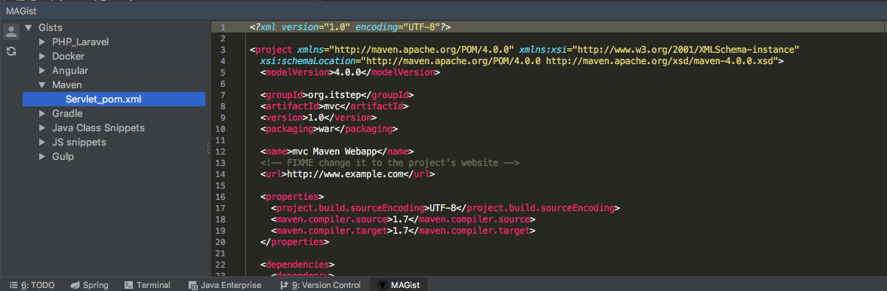

# MAGist plugin for JetBrains IDE
Plugin for loading gists from GitHub.

For using this plugin you need to add your GitHub account to IDE settings.

After it you may click button with user icon at plugin panel and change active account for plugin.

##Screenshot

##How to add GitHub account:
Go to IDE settings

`Settings (or Preferences) -> Version Control -> GitHub`

and click `add account` for enter your credentials.